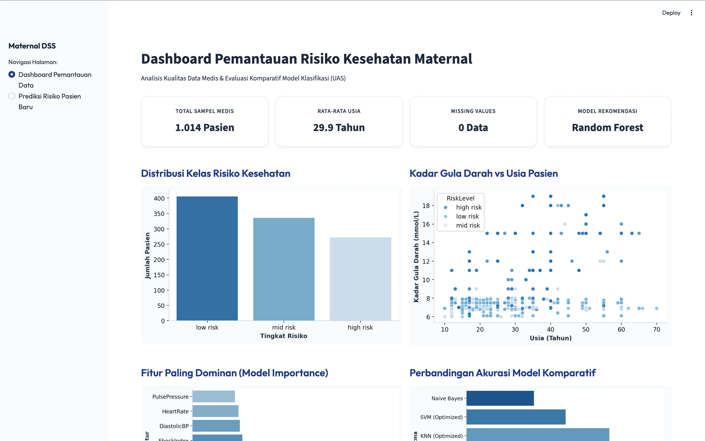
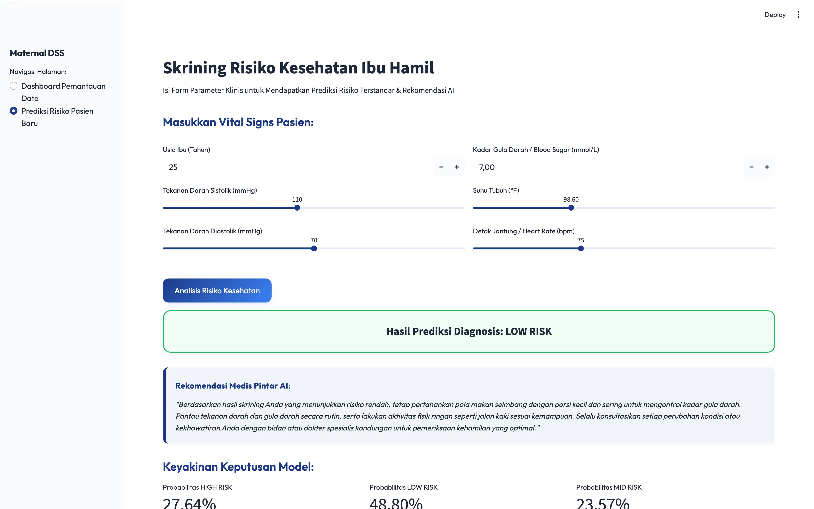
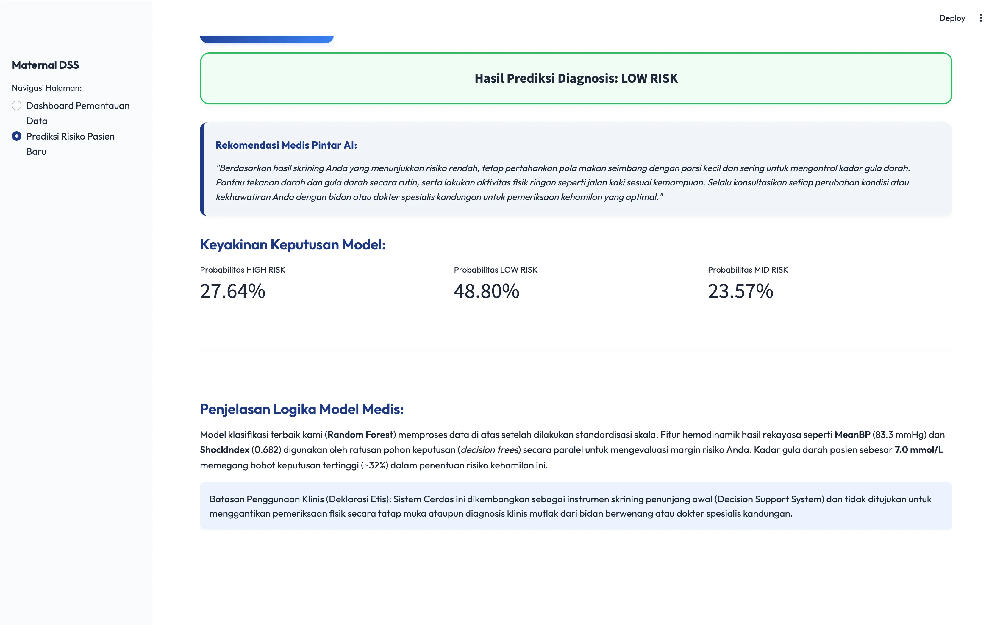

# Proyek Akhir Ujian Akhir Semester (UAS) - Pembelajaran Mesin
### Universitas Dian Nuswantoro | Fakultas Ilmu Komputer

Proyek ini merupakan rancang bangun sistem deteksi dini dan pendukung keputusan klinis (*Clinical Decision Support System* atau CDSS) untuk klasifikasi tingkat risiko kesehatan kehamilan maternal (*Maternal Health Risk*). Sistem ini mengimplementasikan data pipeline machine learning terstruktur menggunakan model terbaik Random Forest (Akurasi: 86.70%, F1-Score Macro: 87.18%) yang diintegrasikan dengan Streamlit Dashboard, Gradio Interface, dan RESTful API FastAPI untuk menunjang skrining klinis yang objektif, etis, dan handal.

**Live Demo (Streamlit Cloud):** [https://uas-ml-kesehatan-a11202415999-4401.streamlit.app](https://uas-ml-kesehatan-a11202415999-4401.streamlit.app)

---

## Struktur Repositori Proyek

Repositori disusun secara modular untuk memudahkan reproduksi eksperimen dan pemeliharaan kode:

```text
uas-ml-kesehatan-a11202415999-4401-danendranawfalradhitya/
├── data/
│   ├── Maternal Health Risk Data Set.csv    # Dataset pemeriksaan klinis ibu hamil
│   ├── data_dictionary.md                   # Kamus data variabel klinis
│   └── source_dataset.md                    # Informasi sumber, lisensi, dan sitasi
├── notebooks/
│   └── uas_ml_kesehatan_knn_nb_svm_optimization.ipynb # Notebook eksperimen baseline & optimasi
├── src/
│   ├── ml_core.py                           # Modul preprocessing & rekayasa fitur hemodinamik
│   ├── preprocessing.py                     # Pipeline pembersihan dan penskalaan data
│   ├── feature_selection.py                 # Seleksi fitur berbasis Mutual Information
│   ├── train.py                             # Pipeline pelatihan utama & GridSearchCV
│   ├── train_knn.py                         # Modul pelatihan K-Nearest Neighbors
│   ├── train_naive_bayes.py                 # Modul pelatihan Gaussian Naive Bayes
│   ├── train_svm.py                         # Modul pelatihan Support Vector Machine
│   ├── train_decision_tree.py               # Modul pelatihan Decision Tree
│   ├── train_random_forest.py               # Modul pelatihan Random Forest
│   ├── train_xgboost.py                     # Modul pelatihan XGBoost
│   ├── evaluate.py                          # Modul evaluasi metrik & laporan klasifikasi
│   ├── api.py                               # Helper fungsi API untuk integrasi FastAPI
│   ├── predict.py                           # Skrip inferensi baris perintah (CLI)
│   └── data_generator.py                    # Generator data sintetis untuk pengujian
├── models/
│   └── best_model.joblib                    # Serialisasi model Random Forest terbaik
├── reports/
│   ├── audit_dataset.json                   # Laporan audit kualitas data
│   ├── all_experiment_results.csv           # Hasil performa perbandingan ke-8 model
│   └── classification_reports.json          # Rincian precision/recall per kelas target
├── presentation/
│   └── presentasi_uas_ml.pdf                # Slide presentasi format PDF
├── report/
│   └── laporan_uas_ml_kesehatan.docx        # Laporan akademis ilmiah lengkap format Word (DOCX)
├── assets/
│   └── pipeline.png                         # Diagram alir data pipeline Machine Learning
├── screenshots/
│   ├── sc1.webp                             # Tampilan dashboard utama aplikasi
│   ├── sc2.webp                             # Formulir input prediksi pasien
│   └── sc3.webp                             # Hasil prediksi dan rekomendasi AI
├── app_streamlit.py                         # Aplikasi Web Dashboard & Form Prediksi Streamlit
├── app_gradio.py                            # Alternatif antarmuka pengguna berbasis Gradio
├── api_fastapi.py                           # Layanan RESTful API backend berbasis FastAPI
├── Dockerfile                               # Berkas konfigurasi Docker image
├── entrypoint.sh                            # Skrip startup container untuk FastAPI & Streamlit
├── api_documentation.md                     # Panduan integrasi detail RESTful API
├── .env                                     # Konfigurasi kunci API asisten medis AI
├── .env.example                             # Contoh template variabel lingkungan
├── requirements.txt                         # Daftar dependensi modul Python
├── README.md                                # Petunjuk instalasi dan cara penggunaan
└── .gitignore                               # Berkas pengecualian pelacakan Git
```

---

## Langkah Instalasi & Persiapan Lingkungan

Ikuti petunjuk di bawah ini untuk mempersiapkan virtual environment lokal:

1. **Masuk ke Direktori Proyek:**
   ```bash
   cd uas-ml-kesehatan-a11202415999-4401-danendranawfalradhitya
   ```

2. **Buat Virtual Environment Python (direkomendasikan Python 3.9 atau lebih baru):**
   ```bash
   python3 -m venv venv
   ```

3. **Aktifkan Virtual Environment:**
   - Di macOS/Linux:
     ```bash
     source venv/bin/activate
     ```
   - Di Windows (Command Prompt):
     ```cmd
     venv\Scripts\activate.bat
     ```

4. **Pasang Semua Pustaka Dependensi:**
   ```bash
   pip install -r requirements.txt
   ```

5. **Konfigurasikan API Key AI (Opsional):**
   Salin berkas `.env.example` menjadi `.env` dan masukkan API Key jika ingin menggunakan fitur Rekomendasi Pintar AI:
   ```bash
   cp .env.example .env
   ```
   Buka `.env` dan ganti nilai variabel dengan API key aktif milik Anda.

---

## Cara Menggunakan dan Menjalankan Proyek

### 1. Menjalankan Generator Data Sintetis (Opsional)
Untuk menghasilkan data sintetis tambahan untuk keperluan pengujian stres:
```bash
python src/data_generator.py
```

### 2. Menjalankan Pipeline Pelatihan & Tuning Model
Skrip ini akan melatih model baseline (KNN, Naive Bayes, SVM), menjalankan GridSearchCV untuk mencari parameter optimal, membandingkannya dengan model ensemble (Decision Tree, Random Forest, XGBoost), menyimpan model terbaik ke direktori `models/`, serta mengekspor berkas laporan performa ke folder `reports/`:
```bash
python src/train.py
```

### 3. Menjalankan Prediksi melalui Baris Perintah (CLI)
Prediksi tingkat risiko kesehatan kehamilan pasien baru secara instan melalui terminal dengan memasukkan 6 variabel klinis dasar:
```bash
python src/predict.py <Age> <SystolicBP> <DiastolicBP> <BS> <BodyTemp> <HeartRate>
```
Contoh:
```bash
python src/predict.py 30 140 90 12.0 98.6 75
```

### 4. Menjalankan Aplikasi Web Dashboard Streamlit
Dashboard Streamlit memuat visualisasi statistik data medis, performa model komparatif, dan formulir prediksi interaktif dengan rekomendasi asisten AI:
```bash
streamlit run app_streamlit.py
```
Buka browser di alamat: `http://localhost:8501` atau akses versi live yang telah di-deploy di [Streamlit Cloud](https://uas-ml-kesehatan-a11202415999-4401.streamlit.app).

### 5. Menjalankan Antarmuka Alternatif Gradio
```bash
python app_gradio.py
```
Buka browser di alamat: `http://127.0.0.1:7860`

### 6. Menjalankan Layanan RESTful API FastAPI
Layanan ini menyediakan REST API untuk integrasi sistem cloud atau aplikasi mobile:
```bash
python api_fastapi.py
```
Buka browser di alamat: `http://127.0.0.1:8000`

Akses dokumentasi interaktif Swagger UI di: `http://127.0.0.1:8000/docs`

---

## Containerization dengan Docker (Deployment)

Image Docker membungkus backend FastAPI dan dashboard Streamlit agar dapat dideploy di server mana pun secara portabel.

1. **Build Docker Image:**
   ```bash
   docker build -t maternal-health-app .
   ```

2. **Jalankan Container (FastAPI di port 8000, Streamlit di port 8501):**
   ```bash
   docker run -d -p 8501:8501 -p 8000:8000 --env-file .env --name maternal-container maternal-health-app
   ```

---

## Tampilan Antarmuka Aplikasi

1. **Dashboard Utama dan Visualisasi Dataset**
   

2. **Formulir Input Prediksi Risiko Kesehatan**
   

3. **Hasil Prediksi dan Rekomendasi Medis AI**
   

---

## Batasan Etika & Penggunaan Data Pasien

Sistem klasifikasi ini dirancang murni untuk tujuan skrining awal (*Decision Support System*) pembantu bidan atau dokter dalam mendeteksi potensi bahaya komplikasi kehamilan secara objektif. Sistem ini **tidak ditujukan menggantikan** diagnosis medis akhir dari dokter spesialis kandungan. Semua identitas pasien dalam proyek ini telah melalui tahap anonimisasi secara ketat.
